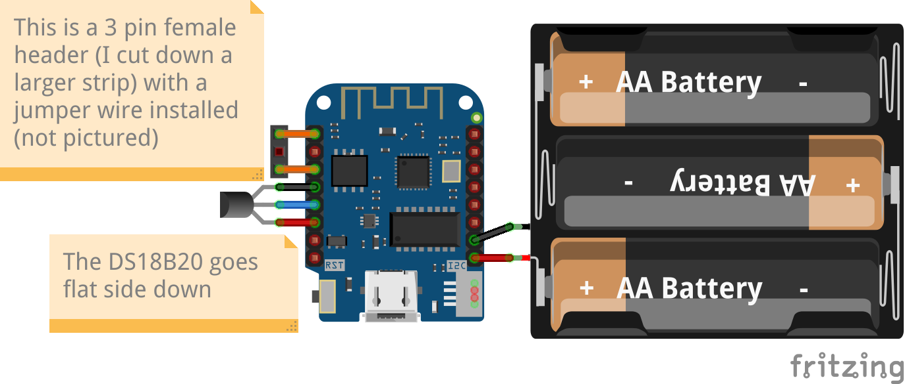

# Sensor puck wiring instructions

## Overview

There are only 10 points which need to be soldered, so it's not tremendously
complex. Just go carefully and methodically and you'll be fine.

## Schematic

## Render

## Step by step instructions

### Solder the jumper wire block

The reset line jumper wire block allows a removable connection between RST and
pin 16 which allows the low power timer output to trigger the reset line. It
would be better if these were adjacent, because then we could use a 2 pin dip
shunt but, alas, if wishes were fishes and all that. So, we use a 3 pin block
and insert a wire into it.

It needs to be removable because it's way less fiddly to flash it with the wire
removed.

Board and block. The block is clipped off a larger one, and the pins are bent so
it sits flush.

In place, but not soldered. Notice how compact it is.

Soldered together. A thing of beauty.

### Solder the temperature sensor

First, prep the temperature sensor with some short lead wires on it. I like to
use red for power, black for ground, and some other color for signal. Note the
positioning of ground and power - this is important. Also, to reduce the risk of
shorting, I covered the legs and joints in heat shrink.

You'll need leads of about 1 in / 2 cm in order for it to fit nicely into the
divider, but there is some wiggle room here. It's better to be slightly short
than slightly long, because the battery holder's wires can wrap around the back
quite easily.

Once you have those sorted, you can solder them to your board.

Ready for soldering. Note that this picture is looking at the bottom of the board
(opposite of the diagrams and render), so
the flat side of the temperature sensor is facing up.

Here it is all soldered and in the orientation as shown in the diagram (though
rotated 180 degrees).

### Solder the battery holder and place it on the divider

From here on, it's smooth sailing - solder the battery holder positive lead to
the VBUS (5V) input (**not 3V3!!**) and the negative lead to GND (ground). Then
you arrange it on the divider as pictured below.

Arranged and ready to go in to a holder.

### Flash and configure it

**WITHOUT BATTERIES INSTALLED**

1. Change to the `sensors` directory.

1. "dot in" the env config

       . setenv.sh

1. Connect the board to your computer.

1. Build, flash, and hit the CLI

       ./flashmonitor.sh

1. You'll get access to the CLI and you can now configure it - set your server, polling interval, etc.

1. Once you have it the way you want, you need to add a short wire between the
   two end holes of that 3 pin block we soldered on - otherwise it will go to
   sleep and not wake up.

For additional pucks, just repeat steps 3 - 6.

### Put it in the holder

From here, you install it into the puck top and affix it to the bosses with 2
screws. The board and sensor go in first, with the battery holder wrapping
around the back. Then the screws go through the battery holder into the puck and
hold it all together. This means that, once assembled, the batteries should be
accessible without having to remove any screws.

### Put the holder on the base

Once you have that assembled, you should be able to:

1. Install batteries.

2. Mount the base someplace convenient.

3. Slide the puck on to the base.

### A note on orientation

I would recommend putting the puck on the holder so that the temperature sensor
is pointed at the floor. Since heat rises, the heat from the board will go out
the vent holes in the top and draw in ambient temperature air from the bottom,
which will flow over the sensor and give you a reasonably accurate reading.

To facilitate this, I recommend marking the "top" of the puck in some fashion. I
affix a label identifying the unit to the top.

## Credits

Pretty pictures generated with [Fritzing](https://fritzing.org/).
